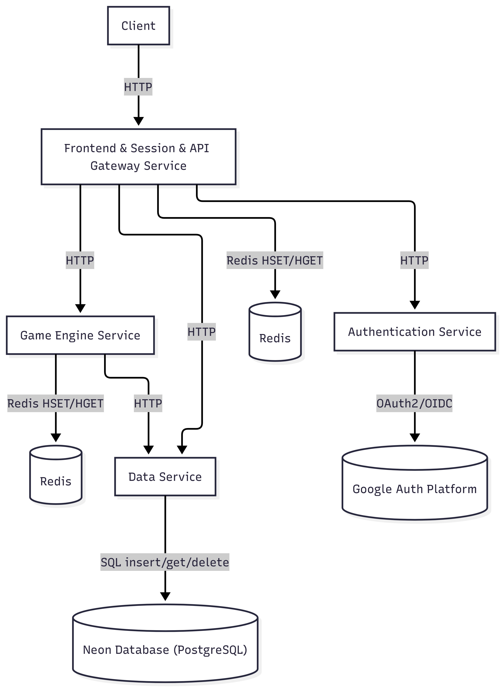

# POROČILO - RSO SEMINAR 2025/2026

## Osnovni podatki

- **Naslov projekta:** Predelava aplikacije Kamen-Škarje-Papir v Cloud Native Mikro Storitve
- **Člani skupine:** Bernard Kučina, Filip Merkan
- **Povezava do organizacije:** https://github.com/RSO-skupina-0
- **Povezava do aplikacije:** http://kamen-skarje-papir.click

---

## Kratek opis projekta

Projekt predstavlja predelavo obstoječe monolitne aplikacije "Kamen-Škarje-Papir" ki je objavljena v [GitHub organizaciji](https://github.com/RSO-skupina-03) v sodobno cloud native arhitekturo z uporabo mikro storitev. Trenutna aplikacija, ki podpira dve različici igre (klasično KŠP in razširjeno KŠPOV z Ogenj/Voda), bo razdeljena na 4 neodvisnih mikro storitev, ki bodo omogočale boljšo skalabilnost, vzdrževanje in razširljivost. Rešitev bo rešila probleme monolitne arhitekture, kot so težko vzdrževanje, omejena skalabilnost in tesno povezanost komponent, ter zagotovila visoko dostopnost in odpornost na napake.

---

## Ogrodje in razvojno okolje

### Tehnologije in ogrodja:
- **Backend:** Python 3.11+, spletni strežnik Gunicorn in Bottle spletno ogrodje
- **Baze podatkov:** PostgreSQL (trajno shranjevanje), Redis (seje)
- **Vsebniki:** Docker, Docker Compose
- **Orkestracija:** Kubernetes
- **Komunikacija:** REST API
- **Avtentikacija:** JWT, OAuth 2.0 integracija
- **CI/CD:** GitHub Actions
- **API Gateway:** NGINX

### Razvojno okolje
- **IDE:** Visual Studio Code  
- **Upravljanje različic:** Git, GitHub  
- **Testiranje API-jev:** Swagger UI  
- **Dokumentacija:** Swagger (OpenAPI), Markdown  

---

## Shema arhitekture

  

---

## Seznam funkcionalnosti mikrostoritev

### 1. Authentication Service
**Funkcionalnosti:**
- Integracija OAuth2/OIDC (Google) in validacija ID žetonov

**Glavne poti:**
  - `GET /auth/google/login` – preusmeritev uporabnika na *Google Auth Platform*
  - `GET /auth/google/callback` – obdelava povratnega klica (*callback*) iz *Google Auth Platform*, generiranje enkratne vstopnice ter posredovanje podatkov mikrostoritvi *Frontend, Session, API Gateway*
  - `GET /auth/redeem` – vrne podatke o prijavljenem uporabniku na podlagi vstopnice

### 2. Game Engine Service
**Funkcionalnosti:**
- Implementacija igralne logike za KŠP, zmagovalec določen po sedmih igrah
- Implementacija igralne logike za KŠPOV, zmagovalec določen po petnajstih igrah
- Shranjevanje stanja v trenurne igre na Redis
  
**Glavne poti:**
  - `POST /game/ksp/nova` – inicializira novo igro *Kamen–Škarje–Papir*
  - `GET /game/ksp/state` – vrne trenutno stanje igre *Kamen–Škarje–Papir*
  - `POST /game/ksp/poteza` – izvede potezo in izračuna novo stanje igre *Kamen–Škarje–Papir*
  
  - `POST /game/kspov/nova` – inicializira novo igro *Kamen–Škarje–Papir–Ogenj–Voda*
  - `GET /game/kspov/state` – vrne trenutno stanje igre *Kamen–Škarje–Papir–Ogenj–Voda*
  - `POST /game/kspov/poteza` – izvede potezo in izračuna novo stanje igre *Kamen–Škarje–Papir–Ogenj–Voda*

### 4. Data Service
**Funkcionalnosti:**
- Shranjevanje zaključenih iger (PostgreSQL)
- Pregled zgodovine iger
- Brisanje zgodovine

**Glavne poti:**
  - `POST /data/ksp/insert` – zapiše končni rezultat igre *Kamen–Škarje–Papir* v podatkovno bazo
  - `GET /data/ksp/get/id` – pridobi ustrezen identifikator igre
  - `GET /data/ksp/history` – vrne zgodovino iger uporabnika
  - `POST /data/ksp/delete` – izbriše zgodovino iger uporabnika

  - `POST /data/kspov/insert` – zapiše končni rezultat igre *Kamen–Škarje–Papir–Ogenj–Voda* v podatkovno bazo
  - `GET /data/kspov/get/id` – pridobi ustrezen identifikator igre
  - `GET /data/kspov/history` – vrne zgodovino iger uporabnika
  - `POST /data/kspov/delete` – izbriše zgodovino iger uporabnika

### 5. Frontend, Session, API Gateway Service
**Funkcionalnosti:**
- Usmerjanje zahtev na mikrostoritve
- Prikaz uporabniškega vmesnika (HTML/CSS/JS)
- Upravljanje sej (piškotki)
- Omejevanje hitrosti zahtevkov (rate limiting)
- Porazdeljevanje bremena med mikrosotiravmi (load balancing)

**Glavne poti:**
  - `GET /` – prikaz strani za prijavo uporabnika
  - `PUT /frontend/login` – prijava uporabnika (*Gost* ali *Uporabnik*) in nastavitev piškotkov
  - `GET /auth/finalize` – klic mikrostoritve *Authentication Service* za dokončanje avtentikacije naročnika preko *Google Auth Platform* in nastavitev piškotkov
  - `GET /igra` – prikaz začetnega menija za igranje iger *Kamen–Škarje–Papir* in *Kamen–Škarje–Papir–Ogenj–Voda*
  
  - `POST /ksp` — pridobi podatke o uporabnikovi izbiri (kamen, škarje ali papir) in jih posreduje mikrostoritvi *Game Engine*
  - `GET /ksp` — iz piškotkov prebere podatke o uporabniku, pridobi stanje igre (klic mikrostoritve *Game Engine*) in prikaže igro
  - `GET /nova_igra_ksp` — inicializacija nove igre *Kamen–Škarje–Papir*
  - `GET /zgodovina_ksp` — pridobi podatke o zgodovini iger *Kamen–Škarje–Papir* (klic mikrostoritve *Data Service*) in prikaže zgodovino
  - `DELETE /brisi_ksp` — izbriše zgodovino iger *Kamen–Škarje–Papir* (klic mikrostoritve *Data Service*) 
  
  - `POST /kspov` — pridobi podatke o uporabnikovi izbiri (kamen, škarje, papir, ogenj ali voda) in jih posreduje mikrostoritvi *Game Engine*
  - `GET /kspov` — iz piškotkov prebere podatke o uporabniku, pridobi stanje igre (klic mikrostoritve *Game Engine*) in prikaže igro
  - `GET /nova_igra_kspov` — inicializacija nove igre *Kamen–Škarje–Papir–Ogenj–Voda*
  - `GET /zgodovina_kspov` — pridobi podatke o zgodovini iger *Kamen–Škarje–Papir–Ogenj–Voda* (klic mikrostoritve *Data Service*) in prikaže zgodovino
  - `DELETE /brisi_kspov` — izbriše zgodovino iger *Kamen–Škarje–Papir–Ogenj–Voda* (klic mikrostoritve *Data Service*)

---

## Primeri uporabe

### Osnovni primeri uporabe:

1. **Prijava naročnika**
   - Naročnik dostopa do aplikacije prek domene [http://kamen-skarje-papir.click](http://kamen-skarje-papir.click).
   - Naročnik klikne gumb **»Prijava Google«**.
   - Sistem naročnika preusmeri na OAuth ponudnika.
   - OAuth ponudnik po uspešni prijavi vrne avtentikacijsko kodo.
   - Naročnik je preusmerjen na začetni meni aplikacije.

2. **Prijava uporabnika**
   - Uporabnik dostopa do aplikacije prek domene [http://kamen-skarje-papir.click](http://kamen-skarje-papir.click).
   - Uporabnik vnese svoje uporabniško ime.
   - Uporabnik klikne gumb **»Prijava«**.

3. **Prijava gosta**
   - Gost dostopa do aplikacije prek domene [http://kamen-skarje-papir.click](http://kamen-skarje-papir.click).
   - Gost klikne gumb **»Gost«**.

4. **Nova igra KŠP/KŠPOV**
   - Uporabnik/gost/naročnik klikne gumb **»KŠP« / »KŠPOV«**.
   - Prikaže se igralni vmesnik za igro KŠP.
   - Ob tem se prek klica mikrostoritve **Game Engine Service** ustvari nova instanca igre KŠP.

5. **Igranje poteze KŠP**
   - Uporabnik/gost/naročnik izbere možnost (**kamen/škarje/papir**).
   - Mikrostoritev **Game Engine Service** izračuna rezultat poteze.
   - V igralnem vmesniku se prikaže posodobljen rezultat.

6. **Igranje poteze KŠPOV**
   - Uporabnik/gost/naročnik izbere možnost (**kamen/škarje/papir/ogenj/voda**).
   - Mikrostoritev **Game Engine Service** izračuna rezultat poteze.
   - V igralnem vmesniku se prikaže posodobljen rezultat.

7. **Pregled zgodovine KŠP/KŠPOV**
   - Naročnik zahteva pregled zgodovine iger KŠP/KŠPOV.
   - Mikrostoritev **Data Service** vrne shranjene rezultate iger KŠP/KŠPOV.
   - Prikaže se zgodovina iger KŠP.

8.  **Brisanje zgodovine**
   - Naročnik zahteva brisanje zgodovine iger.
   - Mikrostoritev **Data Service** izbriše podatke iz baze **PostgreSQL**.
   - Prikaže se prazna zgodovina iger.

### Kompleksnejši primer uporabe:
**Tok:**
1. Naročnik dostopa do aplikacije prek domene [http://kamen-skarje-papir.click](http://kamen-skarje-papir.click).
2. Naročnik klikne gumb **»Prijava z Googlom«** in se uspešno avtenticira.
3. Naročnik klikne gumb **»KŠPOV«**; mikrostoritev **Game Engine Service** ustvari novo instanco igre.
4. Naročnik odigra igro, igralni vmesnik pa prikaže končni rezultat.
5. Mikrostoritev **Data Service** shrani rezultat v bazo **PostgreSQL**.
6. Naročnik klikne gumb **»Zgodovina«**.
7. Mikrostoritev **Data Service** pridobi podatke o zgodovini iger KŠPOV.
8. Naročnik zahteva brisanje zgodovine.
9. Prikaže se prazna zgodovina iger.

