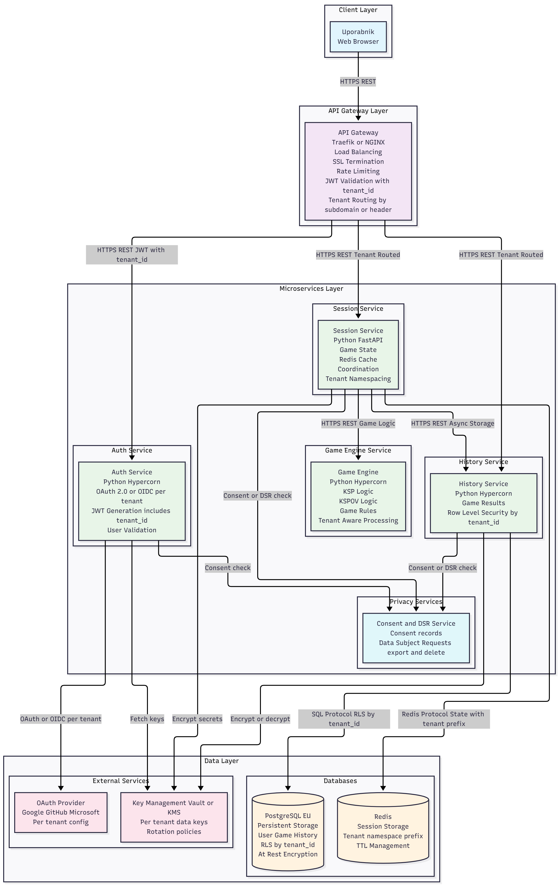

# PRIJAVA PROJEKTA - RSO SEMINAR 2025/2026

## Osnovni podatki

**Naslov projekta:** Predelava aplikacije Kamen-Škarje-Papir v Cloud Native Mikro Storitve

**Člani skupine:** Bernard Kučina, Filip Merkan

---

## Kratek opis projekta

Projekt predstavlja predelavo obstoječe monolitne aplikacije "Kamen-Škarje-Papir" ki je objavljena v GitHub repozitoriju https://github.com/bernardkucina/Kamen-skarje-papir-projektna-naloga v sodobno cloud native arhitekturo z uporabo mikro storitev. Trenutna aplikacija, ki podpira dve različici igre (klasično KŠP in razširjeno KŠPOV z Ogenj/Voda), bo razdeljena na 4 neodvisnih mikro storitev, ki bodo omogočale boljšo skalabilnost, vzdrževanje in razširljivost. Rešitev bo rešila probleme monolitne arhitekture, kot so težko vzdrževanje, omejena skalabilnost in tesno povezanost komponent, ter zagotovila visoko dostopnost in odpornost na napake.

---

## Ogrodje in razvojno okolje

### Tehnologije in ogrodja:
- **Backend:** Python 3.11+ (Hypercorn), Bottle (za migracijo)
- **Baze podatkov:** PostgreSQL (trajno shranjevanje), Redis (seje)
- **Containerizacija:** Docker, Docker Compose
- **Orkestracija:** Kubernetes
- **Komunikacija:** REST API
- **Avtentikacija:** JWT, OAuth 2.0 integracija
- **Monitoring:** Prometheus
- **CI/CD:** GitHub Actions
- **API Gateway:** Traefik/NGINX

### Razvojno okolje:
- **IDE:** Visual Studio Code
- **Verzije:** Git, GitHub
- **Testiranje:** Postman
- **Dokumentacija:** OpenAPI 3.0, Markdown

---

## Shema arhitekture

### Komunikacijski protokoli:
- **API Gateway ↔ Storitve:** HTTP/HTTPS (REST)
- **Storitve ↔ Storitve:** HTTP (notranja komunikacija)
- **Session ↔ Game Engine:** HTTP (synchronous)
- **Session ↔ History:** HTTP (asynchronous)
- **Auth ↔ OAuth Provider:** OAuth 2.0 protokol
- **Session ↔ Redis:** Redis protocol
- **History ↔ PostgreSQL:** SQL protocol

---

## Seznam funkcionalnosti mikro storitev

### 1. AUTH SERVICE
**Funkcionalnosti:**
- Avtentikacija uporabnikov preko OAuth 2.0 (Google, GitHub, Microsoft)
- Generiranje in validacija JWT tokenov
- Upravljanje uporabniških skupin (subscribers/non-subscribers)
- Middleware za avtorizacijo
- OAuth callback handling

**API Endpoints:**
- `GET /auth/login` - OAuth redirect URL
- `GET /auth/callback` - OAuth callback handler
- `POST /auth/validate` - Validacija JWT
- `GET /auth/user-info` - Informacije o uporabniku
- `POST /auth/refresh` - Refresh JWT token

### 2. GAME ENGINE SERVICE
**Funkcionalnosti:**
- Implementacija igralne logike za KSP (3 možnosti)
- Implementacija igralne logike za KSPOV (5 možnosti)
- Deterministično računanje zmagovalca
- Validacija igralnih potez

**API Endpoints:**
- `POST /game/ksp/play` - Igra KSP poteze
- `POST /game/kspov/play` - Igra KSPOV poteze

### 3. SESSION SERVICE
**Funkcionalnosti:**
- Upravljanje aktivnih iger (Redis)
- Kreiranje novih iger
- Posodabljanje stanja iger
- Koordinacija med Game Engine in History

**API Endpoints:**
- `POST /sessions/ksp` - Nova KSP igra
- `POST /sessions/kspov` - Nova KSPOV igra
- `POST /sessions/{id}/move` - Poteza v igri
- `GET /sessions/{id}` - Stanje igre

### 4. HISTORY SERVICE
**Funkcionalnosti:**
- Shranjevanje zaključenih iger (PostgreSQL)
- Pregled zgodovine iger
- Statistike uporabnikov
- Brisanje zgodovine

**API Endpoints:**
- `GET /history/ksp` - Zgodovina KSP iger
- `GET /history/kspov` - Zgodovina KSPOV iger
- `DELETE /history/ksp` - Brisanje KSP zgodovine
- `DELETE /history/kspov` - Brisanje KSPOV zgodovine
- `POST /history/ingest` - Shranjevanje rezultata

### 5. API GATEWAY / WEB UI
**Funkcionalnosti:**
- Usmerjanje zahtev na mikro storitve
- Statični frontend (HTML/CSS/JS)
- JWT middleware
- Rate limiting
- Load balancing

**API Endpoints:**
- Vsi obstoječi UI endpointi (`/`, `/ksp/`, `/kspov/`, itd.)

---

## Primeri uporabe

### Osnovni primeri uporabe:

1. **Prijava uporabnika**
   - Uporabnik klikne "Prijavi se z Google/GitHub"
   - Sistem preusmeri na OAuth provider
   - OAuth provider vrne authorization code
   - Sistem izda JWT token z uporabniškimi pravili

2. **Nova igra KSP**
   - Uporabnik izbere "Nova igra KSP"
   - Session Service ustvari novo igro
   - Sistem prikaže igralno površino

3. **Nova igra KSPOV**
   - Uporabnik izbere "Nova igra KSPOV"
   - Session Service ustvari novo igro z 5 možnostmi
   - Sistem prikaže razširjeno igralno površino

4. **Igra poteze KSP**
   - Uporabnik izbere orožje (Kamen/Škarje/Papir)
   - Game Engine izračuna rezultat
   - Session Service posodobi stanje igre

5. **Igra poteze KSPOV**
   - Uporabnik izbere orožje (Kamen/Škarje/Papir/Ogenj/Voda)
   - Game Engine izračuna rezultat z razširjenimi pravili
   - Session Service posodobi stanje igre

6. **Pregled zgodovine KSP**
   - Uporabnik zahteva zgodovino KSP iger
   - History Service vrne shranjene rezultate
   - Sistem prikaže statistike

7. **Pregled zgodovine KSPOV**
   - Uporabnik zahteva zgodovino KSPOV iger
   - History Service vrne shranjene rezultate
   - Sistem prikaže statistike

8. **Brisanje zgodovine**
   - Uporabnik zahteva brisanje zgodovine
   - History Service počisti podatke iz PostgreSQL
   - Sistem potrdi uspešno brisanje

9. **Odjava uporabnika**
   - Uporabnik se odjavi iz sistema
   - Auth Service invalidira JWT token
   - Sistem preusmeri na OAuth provider za odjavo
   - Sistem preusmeri na prijavo

### Kompleksnejši primer uporabe - Zaključek igre s shranjevanjem:

**Udeleženci:** Uporabnik, Session Service, Game Engine, History Service, Auth Service

**Tok:**
1. Uporabnik igra zadnjo potezo v KSPOV igri (15. poteza)
2. Session Service pošlje potezo v Game Engine
3. Game Engine vrne rezultat z oznako `isFinished: true`
4. Session Service shrani končno stanje v Redis
5. Session Service asinhrono pošlje rezultat v History Service
6. History Service shrani rezultat v PostgreSQL
7. Session Service počisti igro iz Redis
8. Uporabnik vidi končni rezultat in statistike

**Komunikacije:**
- Session → Game Engine (HTTP): `POST /game/kspov/play`
- Session → History (HTTP): `POST /history/ingest`
- UI → Session (HTTP): `POST /sessions/{id}/move`

